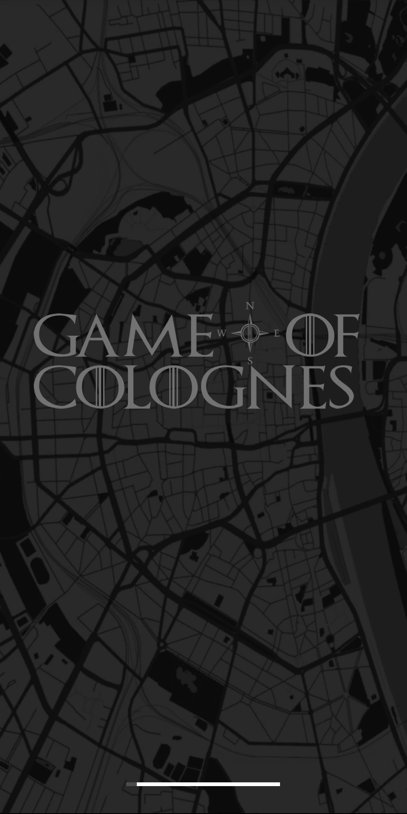
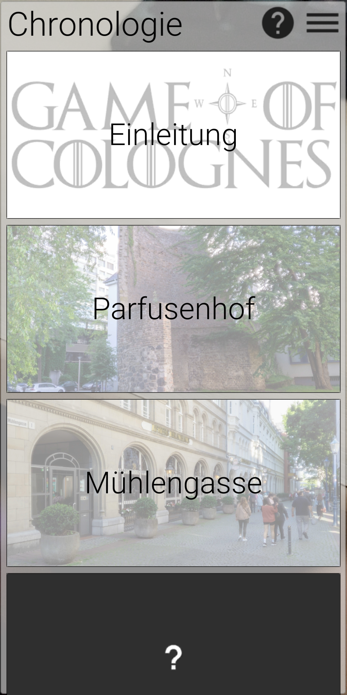

# GameofColognes
In "Game of Colognes" lernen die Spielenden die wichtigsten Schauorte der "Schlacht an der Ulrepforte" kennen und können so ganz neue Ecken von Köln entdecken. Mithilfe von AR müssen die Spielenden hierbei innerhalb von Köln nach Objekten suchen und diese einscannen, um die Geschichte Stück für Stück zu erfahren. 
 
<a href="https://drive.google.com/file/d/1DLZmCD4LhlJUlWQtBIJJ1tNweA9AoxTw/view?usp=sharing">Download der finalen Version</a> 
 
<a href="https://drive.google.com/file/d/1FftePPhGTd4N3PQBo6uHzxF8cye0W1oO/view?usp=sharing">Download Unity-Projektordner</a> 
 
<h2>Historischer Hintergrund/Recherche</h2>
 
Für die Informationen rund um die Schlacht wurden zunächst Kölner Historiker kontaktiert. Diese verwiesen insbesondere auf die Koelhoffsche Chronik von 1499, welche in digitaler Form in der Stadtbibliothek vorlag. 
In dieser, in einer Bastarda-Schrift verfassten, Chronik handeln insgesamt etwa 6 Kapitel von den Ereignissen rund um die Schlacht.
Neben den eigentlichen Ereignissen, mussten vor allem die handelnden Personen recherchiert werden, da diese in der Chronik häufig nicht eindeutig benannt waren. 
Zu diesem Zweck wurde in erster Linie das Archiv des Projektes "Deutsche Biographie" von der Historischen Kommission der Bayerischen Akademie der Wissenschaften verwendet.
Neben der Personenrecherche, war die größte Schwierigkeit die Recherche der tatsächlichen Standorte der verschiedenen Stationen. An dieser Stelle wurde vor allem auf historisches Kartenmaterial zurückgegriffen, etwa auf den Mercatorplan von 1570.
 
<h2>Design</h2>
 
Das Design der App wurde größtenteils eigenhändig erarbeitet und entworfen. Hier wurde Wert daraufgelegt, dass die Gestaltung zu der Idee und dem Konzept der App passt. 
Der Name der App „Game of Colognes“ ähnelt dem Namen der Serie „Game of Thrones“, weswegen sich auch beim Logoentwurf daran orientiert wurde. 
Das Logo der App ist ein einfach gehaltener Schriftzug mit der „Game of Thrones“ Schriftart und einem grauen Hintergrund, passend zur Map, die in der App implementiert ist. Der Schriftzug erscheint unter anderem auf dem Loadingscreen. 
Ebenfalls im Schriftzug enthalten ist das Appsymbol zusammen mit den vier Himmelsrichtungen. Das Appsymbol ist eine Mischung aus dem Buchstaben O und einen Kompass und wurde mittels Photoshop entworfen und schien passend für die Idee der App. Die Map ist eine costumized Karte von Mapbox, ebenfalls in Grau gehalten. Bei ihrer Gestaltung wurde darauf geachtet, dass sie möglichst in das Design der App passt.  Die Icons und die Schriftart, die in der App zu sehen sind, orientieren sich an der Material Design Richtlinien von Google.
 
<h2>Technische Umsetzung</h2>
Als Entwicklungsumgebung wurde Unity verwendet. Für die Einbindung der Karte wurde zusätzlich die Erweiterung Mapbox und für die Objekterkennung Vuforia verwendet. Alles weitere wurde eigenhändig implementiert. 
Viel Arbeit ist hierbei in den Kartenmodus geflossen: Sowohl die Steuerung der Karte via Toucheingabe, als auch die Anzeige des Standorts des Spielers, sowie die farbigen, anklickbaren Bereiche auf der Karte wurden manuell implementiert. 
Insgesamt wurde bei der Implementierung viel Wert auf eine möglichst flexible Programmierung gelegt. So wurden keine Inhalte hardgecodet, der Inhalt der App (wie Texte, Bilder oder ganze Stationen) ist entsprechend in Unity schnell und einfach auszutauschen. Dies ermöglichte einen flexiblen Entwicklungsprozess. 
Auch das Spielerlebnis ist flexibel gehalten: Es existiert zwar grundsätzlich eine festgelegte Chronologie, die Spielenden müssen sich jedoch nicht zwangsläufig an diese halten. Um dennoch einen Überblick zu bewahren und Texte immer wieder aufrufen zu können, wurde ein "Chronologie-Menü" entwickelt, welches die Stationen in ihrer korrekten Reihenfolge darstellt. 
Zeitlich sind die Spielenden ebenfalls flexibel - die App speichert den Spielstand automatisch und ermöglicht so ein zeitversetztes Wiederaufnehmen der Spielsitzung. 
Um den Spielenden ein belohnendes Gefühl zu vermitteln, wenn eine Station gefunden wurde, wurde eine Animation und eine Vibration eingefügt. 
Da die Ladezeit beim Öffnen der App relativ lang ist, wurde ein Loadingscreen eingebaut, der den aktuellen Ladefortschritt in einem Balken anzeigt. 
Innerhalb des Spiels finden die Spielenden nützliche Hinweise und Hilfestellungen im "Hilfe"-Menü. 
Im Kamera-Modus kann außerdem der Handy-interne Blitz eingeschaltet werden, um die gesuchten Objekte auch bei schlechten Lichtverhältnissen scannen zu können. 
Um die Steuerung so intuitiv wie möglich zu gestalten, wurde zusätzlich der native "Zurück"-Button der Android-Geräte mit Befehlen belegt. 
Known issue: Auf leistungsschwachen Endgeräten kann es passieren, dass die App beim erstmaligen Öffnen einfriert. Verantwortlich dafür ist Vuforia, sodass wir hieran leider nichts ändern konnten. Sollte der Bug auftreten, muss die App einfach neu gestartet werden, der Einleitungstext kann dann erneut im Chronologie-Menü aufgerufen werden. 
 
<h2>Screenshots</h2> 

